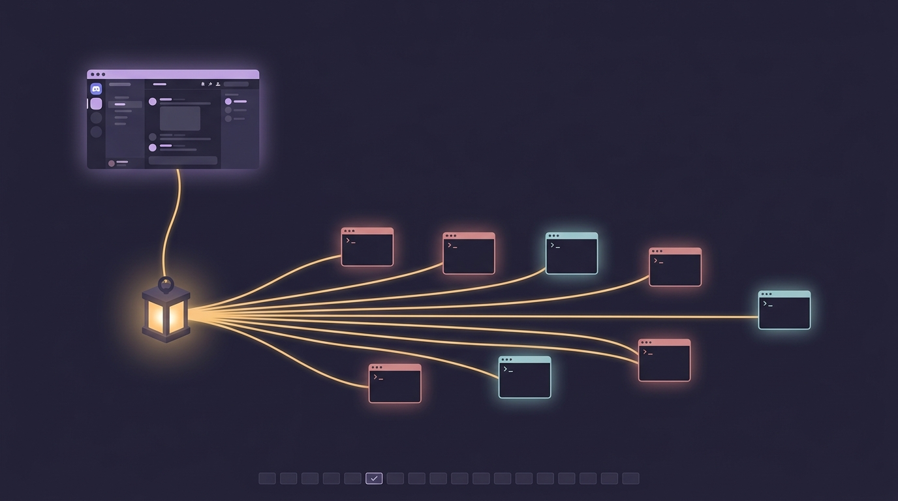

# discord-threads

<p align="center">
  
</p>

<p align="center">
  <a href="https://folio.kz3.dev/p/discord-threads"><strong>Documentation</strong></a>
</p>

**Install in one line.** Paste this into Claude Code, or any coding agent with
a shell on the machine that will run it (Linux or macOS), and answer its questions:

```
Follow the agent.md in https://github.com/killerz3/claude-discord-threads and install and setup
```

[`AGENT.md`](AGENT.md) takes it from there. Manual steps are under
[Install](#install).

A Discord channel for Claude Code where **each conversation is a thread** and
**delivery is guaranteed by a daemon rather than remembered by the model**.

> **Derived work.** This started as a fork of `external_plugins/discord` in
> [anthropics/claude-plugins-official](https://github.com/anthropics/claude-plugins-official)
> (Apache-2.0) and now lives in its own repository. See
> [What changed](#what-changed-vs-the-official-plugin).
>
> **Runs on a host that stays on.** Unlike the other channel plugins, this one
> is a long-lived daemon: it needs [Bun](https://bun.sh) and a machine that stays
> awake, Linux (`systemd --user`) or macOS (a LaunchAgent). Windows works
> inside WSL2. Claude Code itself is started by the daemon, not the
> other way round. That is the point, see [Why](#why).

## Why

The official plugin registers an MCP server that relays Discord messages into a
Claude Code session and asks the model, in prose, to call a `reply` tool. That
produces three problems:

1. **Missed replies.** Replying is a model decision. If a turn ends without the
   tool call, the message is silently never answered.
2. **No isolation.** Every Discord conversation lands in one session, so
   unrelated topics share a context window and get compacted away together.
3. **A gateway per session.** `.mcp.json` is plugin-scoped, so *every* Claude
   Code session — including every interactive SSH session — spawns the server
   and opens its own Discord gateway login on the same bot token.

And nothing is durable: if the session is down when a message arrives, the
notification fails, the error goes to stderr, and the message is gone.

## How this fixes it

Ownership is inverted. A single daemon owns the Discord connection and the turn
lifecycle; Claude Code becomes a worker it drives.

```
ccdiscordd — one process, systemd --user
  │
  ├── discord.js Client ......... the only gateway login on this token
  ├── access gate ............... ported from the official server.ts
  ├── SQLite (bun:sqlite) ....... threads · turns · watermarks · permissions
  ├── turn state machine ........ owns delivery, survives crashes
  └── worker pool ............... Claude Agent SDK, bounded concurrency
        ├── thread A → its own Claude Code session
        └── thread B → its own Claude Code session
```

### Delivery is an invariant, not an instruction

**Workers have no `reply` tool.** The model's ordinary final answer *is* the
Discord message: the daemon reads `result` off the SDK's `SDKResultMessage` and
posts it. There is nothing left to forget.

Every inbound message becomes a persisted row advancing through:

```
queued → seen(👀) → running(⏳) → delivering → done(✅)
                                            ↘ failed(❌) → retry/backoff
```

- The row is written **before** the model runs.
- `done` is set only after Discord confirms a message ID.
- On boot, non-terminal rows are replayed; a row that already has
  `reply_message_ids` reconciles to `done` instead of re-sending, so recovery
  delivers **exactly once**.
- On boot the daemon also fetches messages after each channel's stored
  watermark, so messages that arrived while it was down are still answered.
- Rate-limit errors never drop a turn: it returns to `queued` with backoff.
- A restart never drops one either. `systemctl restart` sends SIGTERM to the
  whole cgroup, so a running turn's Claude Code child dies and the SDK throws —
  which at the catch site looks exactly like a crash. The daemon marks the turn
  `queued` rather than `failed` for the duration of shutdown, so the next boot
  replays it instead of losing the reply. A turn that survives
  `MAX_REPLAY_ATTEMPTS` restarts is dropped, on the theory that by then it is
  the cause rather than the victim.

### Signals

| Signal | Fires when |
|---|---|
| 👀 | the access gate accepted the message |
| ⏳ | a worker picked the turn up (plus a refreshed typing indicator) |
| live status | edited in place as tool calls happen |
| ✅ | Discord confirmed the reply |
| ❌ | error, timeout, or denial |
| 🔐 | a tool needs approval — Allow/Deny buttons, turn blocks |

## What changed vs. the official plugin

| | Official `discord` | This fork |
|---|---|---|
| Transport owner | one MCP server **per Claude Code session** | one daemon |
| Gateway logins | one per session (3 concurrent is typical) | exactly one |
| Reply | model calls a `reply` tool, may forget | daemon posts the turn result |
| Conversations | all share one session | one session per Discord thread |
| If the host is down | message lost | replayed from a watermark |
| Crash mid-turn | reply lost | replayed, delivered exactly once |
| `.mcp.json` | registers `server.ts` | **removed** — no per-session server |

Carried over unchanged, because it is already well hardened: the access gate and
pairing flow, `assertSendable` (blocks exfiltrating the channel state dir),
`safeAttName` and the 2000-char chunker, the permission-reply grammar and button
handler, and attachment download into `inbox/`.

## Install

**Let an agent do it** with the one-line prompt at the top of this README.
[`AGENT.md`](AGENT.md) walks it through every phase, asks only for what it
cannot know (bot token, channel ID, your Discord user ID), and verifies each
step before moving on.

**Or by hand.** Two halves with opposite lifecycles: a skill you install into
Claude Code, and a daemon that runs on its own.

**1. Disable the official plugin.** Leave it on and every Claude Code session
opens its own gateway login on the same token — the bug this fork exists to fix.

```jsonc
// ~/.claude/settings.json
"enabledPlugins": { "discord@claude-plugins-official": false }
```

**2. Point the token at the daemon.** Nothing moves if you already ran the
official plugin; it reads the same files.

```bash
mkdir -p ~/.claude/channels/discord
printf 'DISCORD_BOT_TOKEN=%s\n' "$TOKEN" > ~/.claude/channels/discord/.env
chmod 600 ~/.claude/channels/discord/.env
```

**3. Get the code and install dependencies.** The service files assume the
checkout is at `~/claude-discord-threads`; edit `WorkingDirectory` if you put it
elsewhere.

```bash
git clone https://github.com/killerz3/claude-discord-threads ~/claude-discord-threads
cd ~/claude-discord-threads && bun install
```

**4. Run the daemon.** Check it in the foreground first — it refuses to start
twice, so this is safe even if a copy is already running:

```bash
bun run src/daemon.ts          # expect "gateway connected as <bot>"
DISCORD_RESPONDER=echo bun run src/daemon.ts   # pipeline test, no model tokens
```

Then install the service.

*Linux* (edit the two paths in the unit if your checkout is elsewhere):

```bash
cp systemd/discord-threads.service ~/.config/systemd/user/
systemctl --user daemon-reload
systemctl --user enable --now discord-threads
journalctl --user -u discord-threads -f
```

`loginctl enable-linger $USER` keeps it running when you are logged out.

*macOS* (launchd does not expand `~`, so the plist carries a `__HOME__`
placeholder; change the Bun path inside it if you installed Bun with Homebrew):

```bash
mkdir -p ~/Library/LaunchAgents ~/Library/Logs
sed "s|__HOME__|$HOME|g" launchd/dev.killerz3.discord-threads.plist \
  > ~/Library/LaunchAgents/dev.killerz3.discord-threads.plist
launchctl bootstrap gui/$(id -u) ~/Library/LaunchAgents/dev.killerz3.discord-threads.plist
tail -f ~/Library/Logs/discord-threads.log
```

It starts at every login and restarts after a crash. `launchctl kickstart -k
gui/$(id -u)/dev.killerz3.discord-threads` restarts it, `launchctl bootout
gui/$(id -u)/dev.killerz3.discord-threads` stops it. A LaunchAgent only runs
while you are logged in, so keep the Mac awake (`sudo pmset -a sleep 0` on a
desktop) and logged in.

**5. Install the skills into Claude Code**, so `/discord-threads:access` and
`/discord-threads:configure` are available in your own terminal:

```
/plugin marketplace add killerz3/claude-discord-threads
/plugin install discord-threads@claude-discord-threads
```

**6. Opt a channel in**, from your own terminal — never in response to a Discord
message:

```
/discord-threads:access group add <channel-id> --no-mention
```

## Thread commands

Registered as real Discord application commands, so they appear in the picker
with autocomplete. They are also accepted as plain text, which is what the
daemon actually parses — registration is purely discoverability.

Handled by the daemon, never by the model, so they cost nothing and always
answer.

| Thread | |
|---|---|
| `/help` | the list |
| `/status` | session, model, directory, turn counts |
| `/cwd [path]` | show or change this thread's working directory |
| `/clear` | forget the conversation, keep the thread |
| `/stop` | cancel the turn that is running |
| `/done` | archive the thread |

| Claude | |
|---|---|
| `/usage` | plan limits — 5-hour and weekly windows, with reset times |
| `/cost` | what this thread has spent |
| `/context` | context window used by this conversation |
| `/model [name]` | show, list or set the model for this thread |
| `/model global [name]` | the model every new thread starts on |
| `/permissions [mode]` | show or set the permission mode |
| `/compact` | summarise the conversation to free up context — **costs tokens** |

| Elsewhere | |
|---|---|
| `/threads` | every open thread |

A thread is opened on whichever model `/model global` last named, and says so
in its first message:

```
🧠 Model: **Sonnet** (`sonnet`) · change it with `/model <name>`
```

That banner is edited in place when `/model` changes the thread later, so the
top of the thread always names the model that is answering in it. The global
setting is a *starting point*, not a live binding: threads already open keep
the model they were opened with, so changing it cannot silently move a
conversation under way onto something else.

**Outside a thread** — in the parent channel, or anywhere with no conversation
of its own — `/model` *is* `/model global`, since there is no thread model to
show or set there. That is also the natural place to use it: you set what new
threads open on, then start one. Commands are dispatched before the daemon
decides whether to open a thread, so a command in a channel is answered in the
channel and never spawns one.

`/usage`, `/context` and `/model` read the same structured data as Claude
Code's own slash commands, through SDK **control requests**: the daemon opens a
session whose prompt stream never yields, asks its question, and closes. The CLI
boots but no turn is ever submitted, so these spend no tokens. Results are
cached briefly because each call costs a process spawn.

`/compact` is the exception to "free": it is a real summarisation call. It is
also the one command the daemon does *not* implement — Claude Code's CLI
intercepts it before the model, so the daemon just lets it through. Compaction
completes with an empty result, which would otherwise post an error for a
command that worked, so the daemon reports the boundary event instead:

```
🗜️ Compacted this conversation. 15,867 → 1,922 tokens (13,945 dropped). Took 12.3s.
```

Commands that are inherently interactive or terminal-bound — `/config`, `/vim`,
`/doctor`, `/login`, `/resume` — have no sensible Discord translation and are
deliberately absent. `bypassPermissions` is not offered to `/permissions`:
granting it from a chat message would remove the approval path the buttons exist
to provide.

Anything else is a message for Claude. An unrecognised `/word` is treated as
prose rather than rejected.

Commands are registered **per guild**, for the guilds behind the channels in
`access.json`. Guild commands appear immediately; global ones take up to an hour
to propagate. Because application commands are visible to everyone who can see
the channel, each invocation is authority-checked against the same allowlist as
inbound messages, and replies are **ephemeral** — the answer goes to whoever
asked, not the channel. Registration needs the bot to have been invited with the
`applications.commands` scope; without it the daemon logs a warning and the
plain-text form keeps working.

## Configuration

Environment variables, all optional:

| | |
|---|---|
| `DISCORD_MAX_WORKERS` | concurrent turns (default 3) |
| `DISCORD_PERMISSION_MODE` | worker permission mode (default `auto`) |
| `DISCORD_PERMISSION_TIMEOUT_MS` | how long a prompt waits for a button (default 5 min) |
| `DISCORD_THREAD_IDLE_MS` | archive a thread after this long idle (default 24h) |
| `DISCORD_WORKER_CWD` | default working directory for new threads |
| `DISCORD_RESPONDER=echo` | echo instead of calling the model |
| `DISCORD_LOG_LEVEL` / `DISCORD_LOG_JSON` | `debug`–`error`; `1` for JSON lines |

`auto` is the mode Claude Code's own interactive sessions use: a classifier
approves routine calls and escalates the rest to the Discord buttons. The
stricter `default` prompts on every Bash call, which in practice means several
buttons per question.

## State on disk

State stays where the official plugin puts it, so no migration is needed:

| Path | Contents |
|---|---|
| `~/.claude/channels/discord/.env` | `DISCORD_BOT_TOKEN` (mode 600, **never** in this repo) |
| `~/.claude/channels/discord/access.json` | policy, allowlist, groups, pairing |
| `~/.claude/channels/discord/threads.db` | thread ↔ session map, turn ledger |
| `~/.claude/channels/discord/inbox/` | downloaded attachments |

## Single-user by design

Anyone the gate admits can send prompts to a Claude Code worker running **on
your machine, as your user account**, in permission mode `auto` — which
approves routine tool calls without asking. Admitting someone is therefore much
closer to giving them a shell than to giving them a chatbot. This is the
intended shape of a personal assistant you reach from your phone, and it is why
every default is closed:

- Unknown DM senders get a pairing code and nothing else. Approving one requires
  you to run `/discord-threads:access pair <code>` **in your terminal** — the
  skill refuses to do it in response to a Discord message, because that request
  is exactly what prompt injection looks like.
- Guild channels are dropped until opted in, one channel ID at a time.
- An opted-in channel with no `allowFrom` of its own falls back to your
  allowlist. It does **not** open the bot to everyone in the room, so a channel
  you opt in is not widened later by whoever else joins it.
- Permission-prompt buttons and registered slash commands are authority-checked
  against the top-level `allowFrom`, so a bystander who can see the prompt in a
  shared channel still cannot answer it.
- `bypassPermissions` is not reachable from chat at all.

The settings that widen this are `--allow` on a channel and `access allow
<id>`. Treat both as "give this person sudo on my laptop", because that is the
size of it.

Beyond the risk, Anthropic's Agent SDK terms do not permit offering claude.ai
logins or rate limits to third parties without prior approval, and a bot that
lets *other people* send prompts through your subscription is exactly that. Keep
`allowFrom` to your own account. The access skill will not widen it without an
explicit override typed by you.

## Bot permissions

The bot needs `VIEW_CHANNEL`, `SEND_MESSAGES`, `SEND_MESSAGES_IN_THREADS`,
`CREATE_PUBLIC_THREADS`, `READ_MESSAGE_HISTORY`, `ADD_REACTIONS`,
`ATTACH_FILES`, and `MANAGE_THREADS` (for archiving and locking).

## License

Apache-2.0, inherited from the upstream project. See `LICENSE`.
